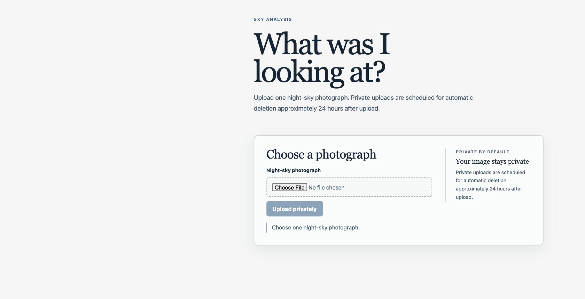
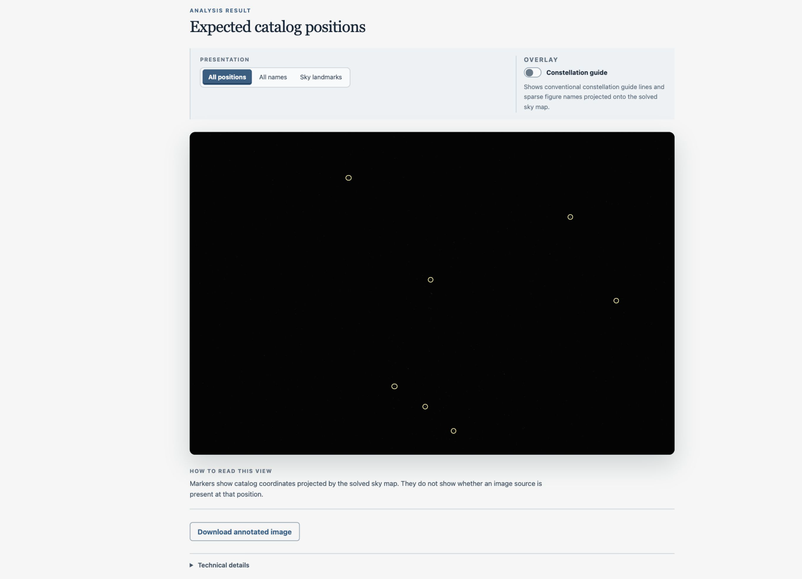
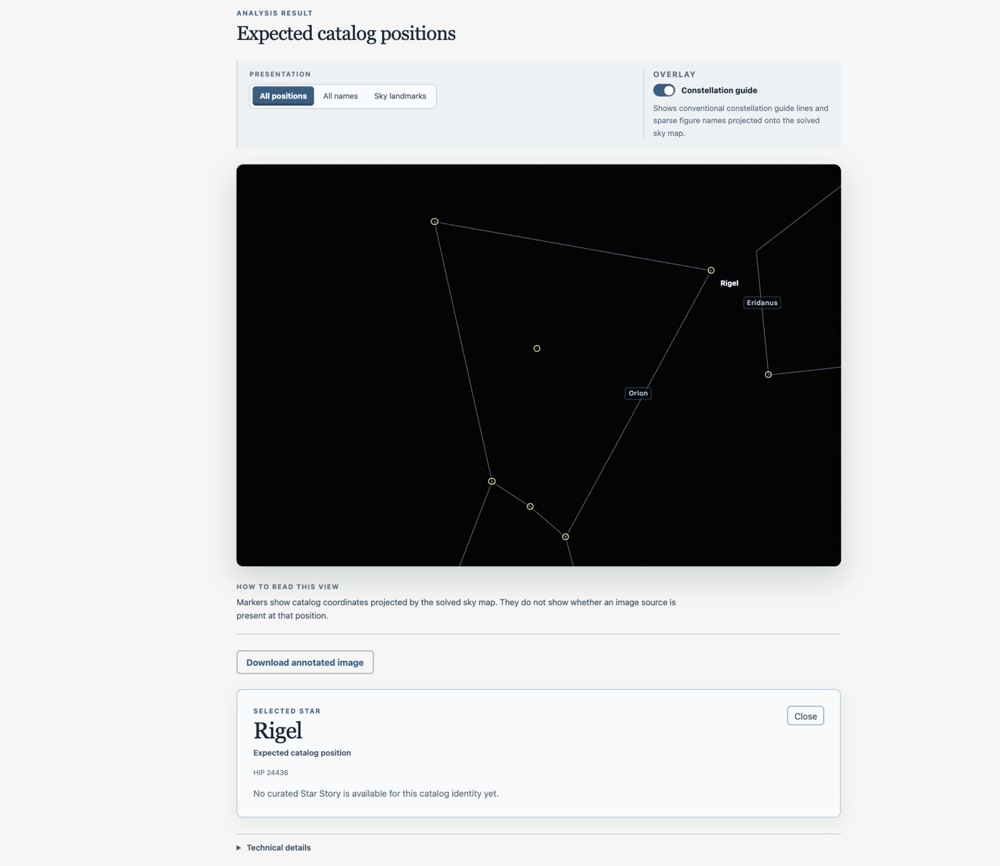
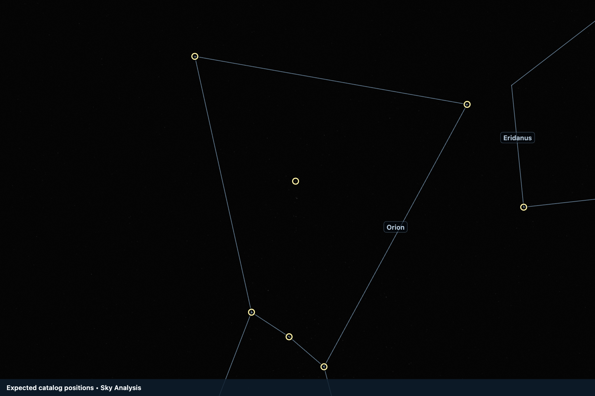

# Sky Analysis

A web application for analyzing night-sky photographs.

I built this project because I am interested in astronomy and software development. The goal is to help users understand where their photograph is pointing in the sky while keeping the result clear about what the system actually knows.

The project is still in development.

> Images uploaded by users are private by default and scheduled for automatic deletion.

## Upload

Users can upload a night-sky photograph for analysis.

The application is designed around a simple idea:

**Privacy by default, share by choice.**

Uploaded images are private and are scheduled for automatic deletion after approximately 24 hours. Users can also delete their upload themselves.

## Analysis Result

The application uses astronomical plate solving to find where an image is pointing in the sky.

After a successful solve, it can project catalog positions onto the photograph.

An important rule in this project is:

**Expected catalog position does not mean a star was detected in the image.**

The application tries to show the evidence it has without making a stronger claim than the evidence supports.

## Explore the Sky

Users can explore the solved sky area by:

- Showing catalog positions
- Showing star names
- Showing sky landmarks
- Turning constellation guides on or off
- Selecting a catalog position to see more information

The constellation guide shows conventional constellation lines projected onto the solved sky map. It does not mean the application detected a constellation in the photograph.

## Annotated Export

Users can download an annotated version of the result.

The exported image keeps the catalog markers and selected overlays so the result can be viewed outside the application.

## How It Works

The application has a Next.js frontend and a FastAPI backend.

A simplified flow is:

Night-sky photograph
        ↓
Private upload
        ↓
FastAPI
        ↓
Astrometry.net
        ↓
Solved sky coordinates
        ↓
Catalog projection
        ↓
Explore / Export / Delete

PostgreSQL stores application data and MinIO is used for private image storage.

## Tech Stack

- Python
- FastAPI
- Next.js
- PostgreSQL
- MinIO
- Astrometry.net
- Docker
- Git
- Automated testing

## Privacy

Privacy is an important part of the project.

The system is designed so that:

- User images are private by default
- Private image access is controlled by the backend
- Users can delete their upload
- Uploads are scheduled for automatic deletion
- Internal services are not intended to be directly exposed to users

Privacy is treated as part of the system design, not only as a message in the UI.

## Scientific Approach

Another important idea is:

**Evidence before interpretation.**

Plate solving tells the application where the photograph is pointing.

From that result, the application can calculate where known catalog objects are expected to appear.

But this is different from detecting those objects directly from image pixels.

If the evidence is not enough, the application should not guess.

## Current Status

The first usable version of the application is complete.

It currently supports the main flow:

Upload → Analyze → Explore → Export → Delete

The project is still being tested and improved before wider public use.

Future scientific features will only be added when the system has enough evidence to support them correctly.

## What I Learned

This project helped me learn about:

- Connecting scientific software with a web application
- Building APIs with FastAPI
- Working with Next.js
- PostgreSQL and object storage
- Private file access
- Application lifecycle and cleanup
- Automated testing
- Scientific uncertainty
- Designing software around evidence instead of guesses

It also taught me that a technically correct calculation and a scientifically correct claim are not always the same thing.

## Source Code

The main development repository is private.

This repository is a public overview of the project for my portfolio.
